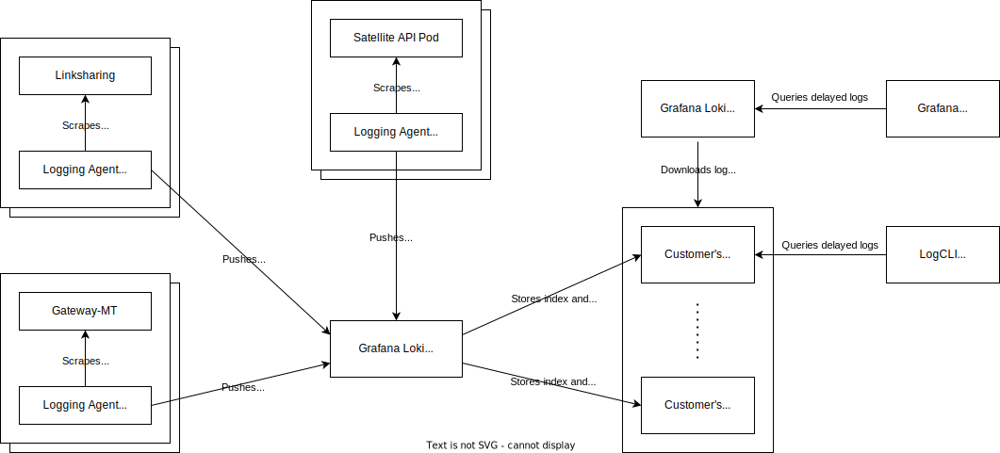
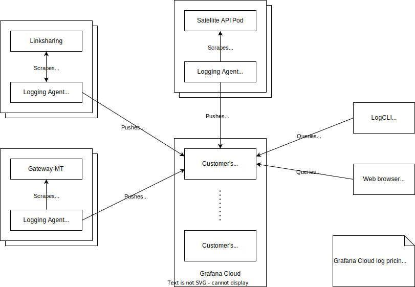
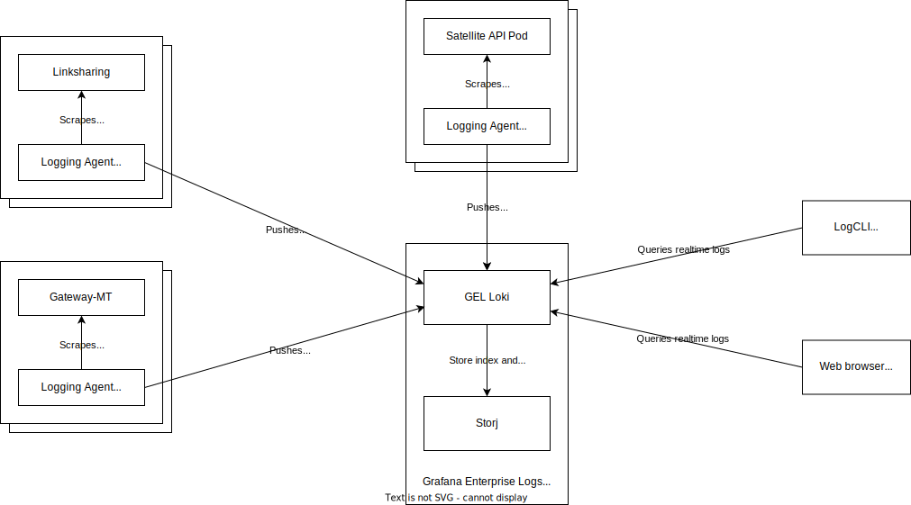

tags: ["logs", "access logs", "satellite", "edge", "linksharing", "gateway"]
---

# Title

Access Logs for Storj Customers

## Essentials

### Header

Date: 2023-10-18

Owner: Kaloyan Raev

Accountable:
-

Consulted:
-

Informed:
-

### Context

Storj customers need more information regarding their own customers' retrieval of data to:

- Drive end-of-month billing workflows.
- Provide engagement analytics (such as viewership).
- Ongoing usage information so their users can see associated costs in somewhat real-time (more frequently than at the end of the month).
- Diagnose abuse use of their content.

We already collect access logs and push them in Google BigQuery for our internal analysis. However, they are not accessible to our customers. Also, our customers want more info logged than we currently do.

### Goals

- Make it possible for customers to enable access logs per bucket.
- Collect access logs from Linksharing, Gateway-MT, and Satellite API pods.
- Store the access logs into a target customer's Storj bucket.
- The delay between an event happening and being recorded in the access logs should not exceed one hour.
- Explore ways to provide real-time access logs.
- Have a solution that works for all Storj product flavors.
  
### Approach / Design

The design described below is based on [Grafana Loki](https://grafana.com/oss/loki/) - a log aggregation stack by Grafana.

Grafana Loki comes in a few different flavors:
- [Open source stack](https://grafana.com/oss/loki/) (AGPLv3) to use in the Storj infrastructure to aggregate and push logs to customer's Storj buckets.
- [Grafana Cloud](https://grafana.com/products/cloud/logs/) - a SaaS solution that we can use for providing real-time access logs.
- [Grafana Enterprise Logs (GEL)](https://grafana.com/docs/enterprise-logs/latest/) - a commercial on-premise solution that we can use for large Storj Private Cloud installations.

#### Data fields in the access logs

Below are the data fields to include in the access logs.

We should avoid logging any secrets like access grants or sensitive data like individual IP addresses. See the [Security / Privacy](#security--privacy) section for mode details.

| Name | Description | Sample Value | Notes |
|------|-------------|--------------|-------|
| Timestamp | The time at which the request was received; these dates and times are in Coordinated Universal Time (UTC), following the ISO 8601 standard. | 2023-10-18T09:37:06Z |  |
| HTTP Method | The HTTP method used for the request (HEAD, GET). | GET | Amazon's S3 Bucket Logs return something called "Operation" which looks like `REST.PUT.OBJECT` |
| Referer | The value of the HTTP Referer header, if present. | http://www.example.com/webservices |  |
| User Agent | The value of the HTTP User-Agent header. | curl/7.15.1 |  |
| Object Size | The total size of the object, in bytes. | 3462992 |  |
| Bytes Sent | The number of response bytes sent, excluding the HTTP protocol overhead, or - if zero. | 2662992 |  |
| HTTP Status | The numeric HTTP status code of the response. | 200 |  |
| Project | The hex-encoded Public ID of the Storj project that is serving the request. | ef1b109249684b3e8466a865ce22a262 |  |
| Bucket | The bucket name that is serving the request. | test-bucket |  |
| Object Key | The object key (path) that is requested. | /photos/IMG_20200301_153448733.jpg |  |
| Access Key ID | The S3 access key ID used to authenticate the request. | juudmr5vp28bjrqhny7luyibs9pq |  |
| Macaroon Head | The hex-encoded macaroon head of the API key. | 70d745b9cb906bb75b4979a8160b8e8bef8e9d6b10d64d6ecd0f17efa02d649e |  |
| Satellite Address | The Node URL of the satellite serving the request. | 12EayRS2V1kEsWESU9QMRseFhdxYxKicsiFmxrsLZHeLUtdps3S@us1.storj.io:7777 |  |
| Request ID | The unique identifier of the request assigned by Storj | cgPYJruaG9W | Can be used to correlate with satellite access logs and Storj internal logs. |
| Range Bytes | The value of the Range header if present. | bytes=0-8000000 |  |
| Host Header | The endpoint used to connect to the Storj S3 compatible gateway. | https://gateway.storjshare.io |  |
| Total Time | The number of milliseconds that the request was in flight from the server's perspective. This value is measured from the time that your request is received to the time that the last byte of the response is sent. Measurements made from the client's perspective might be longer because of network latency. | 70 |  |
| Time to First Byte | The number of milliseconds that Storj spent processing your request. This value is measured from the time that the last byte of your request was received until the time that the first byte of the response was sent. | 10 |  |
| Location | The datacenter code where the edge server is located. | TR2 | This is used for troubleshooting problems such as latency issues. |
| Origin | The value of the HTTP Origin header, if present. | https://www.example.com |  |

#### Storj bucket as the Loki Tenant ID

Grafana Loki is [multi-tenant](https://grafana.com/docs/loki/latest/operations/multi-tenancy/). The logging agent can annotate the log entries with a Tenant ID while scraping them. The Loki server receives the annotated logs and aggregates them in different streams.

As we want a separate log stream for each Storj bucket, it is natural to set the Loki Tenant ID to something uniquely identifying a Storj bucket.

Storj bucket names are unique within a Storj project but not across different Storj projects. The Storj project public ID is a UUID - unique across all Storj projects, accounts, and satellites. Therefore, concatenating the bucket's project public ID and the bucket name is a unique identifier to use as the Loki Tenant ID.

Examples:
- `ef1b109249684b3e8466a865ce22a262_test-bucket`
- `033f72b1cb4e437096fa238bf6b8502f_prod`

#### Scraping and annotating access logs

Three services generate access logs: Linksharing, Gateway-MT, and the Satellite API Pods. Each of these services has multiple instances. A logging agent will run next to each instance and scrape the generated access logs. The logging agent may filter the log entries or re-arrange their log format, but its main task is to annotate the log entries with the Tenant ID and push them to the Grafana Loki destination.

Grafana has extensive documentation on how to [send log data to Loki](https://grafana.com/docs/loki/latest/send-data/).

We can use two Grafana agents to scrape the logs: [Promtail](https://grafana.com/docs/loki/latest/send-data/promtail/) and [Flow Agent](https://grafana.com/docs/agent/latest/flow/). We should focus on the new Flow Agent as it is more flexible and will eventually replace the older Promtail agent.

#### Delayed access logs into a Storj bucket

In this scenario, the logging agent will push the tenant-annotated logs to a Grafana Loki server we run in the Storj environment. The Loki server will aggregate the logs in different stream per tenant. The compressed index and chunks will be uploaded to a target customer Storj bucket. As it takes time to aggregate enough logs for a chunk, the logs will appear in the target Storj bucket with a delay.

We target the industry standard of a 1-hour delay for access logs. For example, Amazon S3 makes access logs available [within a few hours](https://docs.aws.amazon.com/AmazonS3/latest/userguide/ServerLogs.html), and Google Cloud Storage generates them [hourly](https://cloud.google.com/storage/docs/access-logs). Access logs may be available quicker if the bucket is requested more often and a complete chunk is aggregated in less than an hour. We will follow the [best practices](https://grafana.com/docs/loki/latest/configure/bp-configure/#use-chunk_target_size) for configuring the chunk target size.

Loki does not support a separate object store per tenant, but we can fork the code and implement such a backend. We already have a POC implementation (TODO: link to Github). Eventually, we should contribute it to the upstream project.

Alternatively, we can use a single object store for the entire Loki server and have a separate jobs that would iterate over the chunks and move them to the respective customer buckets. The move would involve downloading the data from the single Loki bucket, upload it to the customer bucket, and delete it from the Loki bucket. This is less optimal, but easier to implement.

Storj will operate the Loki server in write-only mode (with `-target=write,compactor` flag), i.e. it won't allow querying the logs. We chose the write-only mode for easier operation.

Customers will query their access logs not through the Storj Loki server but with Loki client tooling ([LogCLI](https://grafana.com/docs/grafana-cloud/monitor-infrastructure/logs/export/query-exported-logs/#querying-the-archive-using-logcli) or [read-only Loki server](https://grafana.com/docs/grafana-cloud/monitor-infrastructure/logs/export/query-exported-logs/#query-the-archive-using-loki-in-read-only-mode)) configured directly to their target Storj bucket.

Storing the logs and querying them from a customer's Storj bucket incurs usage of storage and egress. This implicit cost is proportional to the amount of logs stored and the intensity of querying them, so we don't need to charge an additional fee.

#### Real-time access logs in Grafana Cloud

If customers want real-time access logs, it would be easier for us to direct customers to Grafana Cloud instead of scaling and maintaining the Storj Loki server for real-time querying. We can configure the logging agent to push the logs to both the customer's Grafana Cloud account and the Storj Loki server. We have yet to research how such a configuration would look and if the Grafana Flow agent would require a code change.

As real-time access logs do not incur storage and egress usage like the delays logs, we should charge an additional fee for them. Moreover, real-time access logs are a superior feature to the industry standard of 1-hour delayed logs.

Grafana Cloud provides 50GB of free logs with 14-day retention for free accounts. Pro accounts come with 100GB free with 30-day retention and  $0.50/GB above the 100GB.

#### Access logs in Storj Private Cloud

Storj Private Cloud can come in many different setups. We can implement delayed and real-time logs with the open-source Loki server for customers who prefer to have the complete installation open-source.

We also have the option to use [Grafana Enterprise Logs (GEL)](https://grafana.com/docs/enterprise-logs/latest/) for more complex setups where the customer would be willing to pay for the GEL license and support.

#### Configuring a bucket for access logs

The customer will be able to turn on access logs per bucket. By default, a bucket does not generate access logs. The customer may decide later to turn off the access logs for the bucket.

Initially, turning access logs on and off will be requested with a support ticket. Designing and implementing a UI will be the subject of a future design doc.

The customer will select a source bucket to generate access logs and a target bucket to receive the delayed access logs. The customer will create S3 credentials with full permission to the target bucket. The Storj Loki server will configure these S3 credentials as a target object store for the Tenant ID representing the source bucket.

The target bucket can be either in the same Storj project as the source bucket, a different Storj project, or even a different Storj account. Choosing the source bucket as the target bucket is not recommended, as it will cause an infinite loop of access log generation.

Customers who want to configure log retention for the delayed access logs can configure the [S3 credentials with Object TTL](https://docs.storj.io/dcs/buckets/object-lifecycles#setting-object-ttl-in-the-access-grant-s3-credentials) for the desired retention period.

Customers who want to turn on real-time access logs will provide the Push URL to their Grafana Cloud stack to receive the logs. The Push URL will include their Grafana Cloud user ID and API token. The logging agent will use the Push URL as a destination for the generated access log for the configured Storj bucket.

## Disclaimers

### Anti-goals

- Easy to configure.
  - Initially, it's okay for customers to open a support ticket to enable access logs.
  - No need to think about UI yet.
- Log targets outside of Storj.
  - We are a data storage company. Hence, we want to store the access logs in Storj buckets. This way, storing and querying the logs implicitly incur usage of our product so that we can provide this feature without additional fees.
  - We may allow non-Storj targets for specific use cases like Grafana Cloud for real-time logs. It could be a premium feature for an additional fee.

### Alternatives considered

- Implement it all in-house.

### Open question

- Should we log linksharing requests beyond those to raw content like listing buckets and prefixes, displaying the object map, etc.?

## Reminders

### Security / Privacy

- Should we encrypt object keys?
  - We checked with customers interested in the access logs feature, and they responded that they need the object keys unencrypted to make use of the logs. Additional steps to decrypt the object keys would be only a source of inconvenience.
  - Nevertheless, access logs generated by the satellite would still have encrypted object keys as the satellite cannot decrypt them. Unencrypted object keys will be provided only by access logs from the Edge services.
  - This may lead to incomplete view of access if part of the access is directly via uplink and not through the Edge services. In such a case, the custom would still need a way to decrypt the object keys. However, this is a minor use case as all customers that expressed interest in access logs so far use the Edge services entirely to access the Storj network.
- RequestURI and access grants.
  - We should filter any secrets from RequestURI as well as access grants, which are a secret too.
- IP addresses and GDPR.
  - We may need to need to filter IP address to the /24 subnet.

### Observability

### Test plan

### Rollout

### Rollback

## Out of scope

- UI for enabling and disabling access log. Initially, this will be requested with a support ticket.

## Minimum Viable Product (MVP)

- Enable and disable access logs with a support ticket. No UI yet.
- Linksharing logs only: object download requests.
  - The Linksharing service will be manually configured to generate logs for the enabled buckets.
- Two Loki instances for load balancing and high availability.
- Single object store for the Loki server.
  - A separate job to distribute the logs from the Loki object store to the respective customer buckets.
  - The S3 credentials to the target customer bucket will be manually configured to the job.